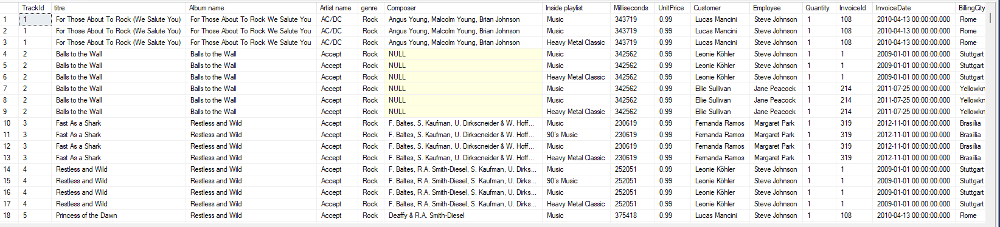
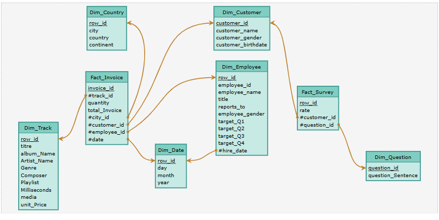

1) Quels sont les artistes qui ont le plus de succès auprès des hommes/femmes
2) Quelle est la tranche d'age la moins satisfaite par le services (via survey.xls)
3) Quel est l'employé qui a vendu le moins => qui n'a pas atteint son quota trimestriel
4) Quels sont les titres/genre les plus populaires par pays/continents
5) 

pour faire le schéma on peut utiliser mocodo online
en gros via python on peut créer les différentes structures

Piste 1 : une grosse table qui fait tout .
un peu trop gros

```sql
select top 1000
t.TrackId,
t.Name as titre,
a.Title as 'Album name',
art.Name as 'Artist name',
g.Name as genre,
t.Composer,
p.Name as 'Inside playlist',
Milliseconds,
t.UnitPrice,
c.FirstName+' '+c.LastName as Customer,
e.FirstName+' '+e.LastName as Employee,
il.Quantity,
il.InvoiceId,
i.InvoiceDate,
i.BillingCity,
i.BillingCountry,
i.Total,
m.Name as media
from Track as t
join InvoiceLine as il on t.TrackId= il.TrackId
join Invoice as i on i.InvoiceId = il.InvoiceId
join Album as a on t.AlbumId = a.AlbumId
join MediaType	as m on t.MediaTypeId = t.MediaTypeId
join genre as g on g.GenreId=t.GenreId
join Customer as c on c.CustomerId = i.CustomerId
join Employee as e on e.EmployeeId = c.SupportRepId
join Artist as art on art.ArtistId = a.ArtistId
join PlaylistTrack as pt on t.TrackId = pt.TrackId
join Playlist as p on p.PlaylistId = pt.PlaylistId


```



piste 2 : quelques jointures:

table dimm_track:

* trackId
* titre
* albumName
* ArtistName
* Genre
* Composer
* Playlist
* Milliseconds
* media
* unnitPrice

table dimm customer:

* customerId
* CustomerName
* BillingCity
* BillingCoutry
* Employee

via excel:

* customerGender
* customerBirthdate

table dimm employee:

* employeeId
* employeeName concat (first+ lastname)
* title
* reportsTo
* employeeGender
* hireDate
* birthdate

Table Fact Invoice:

* row_id
* invoiceId
* customerId
* employeeId
* trackId
* quantity
* invoiceDate
* totalInvoice

Script mocodo pour créer le schéma

```python
DimTrack: trackId, titre, albumName, ArtistName, Genre, Composer, Playlist, Milliseconds, media, unitPrice
DimCustomer: customerId, CustomerName, BillingCity, BillingCountry, Employee, customerGender, customerBirthdate
DimEmployee: employeeId, employeeName, title, reportsTo, employeeGender, hireDate, birthdate
FactInvoice: row_id, invoiceId, customerId, employeeId, trackId, quantity, invoiceDate, totalInvoice

APPARTENIR1, 0N FactInvoice, 11 DimTrack
APPARTENIR2, 0N FactInvoice, 11 DimCustomer
APPARTENIR3, 0N FactInvoice, 11 DimEmployee
```


maintenant on intègre les données excel

Table fact target

* employeId
* year
* targetQ1
* targetQ2
* targetQ3
* targetQ4

table DImm continent

* countryId
* coutryName
* countryContinent

table FACT survey

* customerID
* customerGender
* birthdate( convert concat (day,month,year),date)
* rateQ1
* rateQ2
* rateQ3

table dimm question

* questionId
* questionSentence

```python
%%mocodo
:::
Dim_Country: row_id, city, country, continent
:::
Dim_Customer: customer_id, customer_name, customer_gender, customer_birthdate
:::::


:::
Fact_Invoice: invoice_id, track_id, quantity, total_Invoice, city_id, customer_id, employee_id, date
:::
Dim_Employee: row_id, employee_id, employee_name, title, reports_to, employee_gender, target_Q1, target_Q2, target_Q3, target_Q4, hire_date
:
Fact_Survey: row_id, rate, customer_id, question_id
:::


:
Dim_Track: row_id, titre, album_Name, Artist_Name, Genre, Composer, Playlist, Milliseconds, media, unit_Price
:::
Dim_Date: row_id, day, month, year
:::::
Dim_Question: question_id, question_Sentence
:


```



Script SQL

```sql
CREATE TABLE DimCountry (
    row_id INT IDENTITY(1,1) PRIMARY KEY,
    city VARCHAR(100),
    country VARCHAR(100),
    continent VARCHAR(100)
);

CREATE TABLE DimCustomer (
    customer_id INT IDENTITY(1,1) PRIMARY KEY,
    customer_name VARCHAR(100),
    customer_gender CHAR(1),
    customer_birthdate DATE
);

CREATE TABLE DimEmployee (
    row_id INT IDENTITY(1,1) PRIMARY KEY,
    employee_id INT,
    employee_name VARCHAR(100),
    title VARCHAR(100),
    reports_to INT,
    employee_gender CHAR(1),
    target_Q1 DECIMAL(10, 2),
    target_Q2 DECIMAL(10, 2),
    target_Q3 DECIMAL(10, 2),
    target_Q4 DECIMAL(10, 2),
    hire_date INT,
    FOREIGN KEY (hire_date) REFERENCES DimDate(row_id)
);

CREATE TABLE DimTrack (
    row_id INT IDENTITY(1,1) PRIMARY KEY,
    titre VARCHAR(100),
    album_Name VARCHAR(100),
    Artist_Name VARCHAR(100),
    Genre VARCHAR(50),
    Composer VARCHAR(100),
    Playlist VARCHAR(100),
    Milliseconds INT,
    media VARCHAR(50),
    unit_Price DECIMAL(10, 2)
);

CREATE TABLE DimDate (
    row_id INT IDENTITY(1,1) PRIMARY KEY,
    day INT,
    month INT,
    year INT
);

CREATE TABLE DimQuestion (
    question_id INT IDENTITY(1,1) PRIMARY KEY,
    question_Sentence VARCHAR(255)
);

CREATE TABLE FactInvoice (
    invoice_id INT IDENTITY(1,1) PRIMARY KEY,
    track_id INT,
    quantity INT,
    total_Invoice DECIMAL(10, 2),
    city_id INT,
    customer_id INT,
    employee_id INT,
    date INT,
    FOREIGN KEY (track_id) REFERENCES DimTrack(row_id),
    FOREIGN KEY (city_id) REFERENCES DimCountry(row_id),
    FOREIGN KEY (customer_id) REFERENCES DimCustomer(customer_id),
    FOREIGN KEY (employee_id) REFERENCES DimEmployee(row_id),
    FOREIGN KEY (date) REFERENCES DimDate(row_id)
);

CREATE TABLE FactSurvey (
    row_id INT IDENTITY(1,1) PRIMARY KEY,
    rate DECIMAL(10, 2),
    customer_id INT,
    question_id INT,
    FOREIGN KEY (customer_id) REFERENCES DimCustomer(customer_id),
    FOREIGN KEY (question_id) REFERENCES DimQuestion(question_id)
);
```
