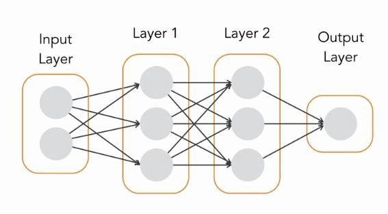

## Understanding Hidden Layers in Neural Networks

A hidden layer in the context of artificial [neural networks](https://deepai.org/machine-learning-glossary-and-terms/neural-network) refers to a layer of [neurons](https://deepai.org/machine-learning-glossary-and-terms/neuron) that is neither the input nor the output layer. Hidden layers are what make neural networks "deep" and enable them to learn complex data representations. They are the computational workhorse of [deep learning](https://deepai.org/machine-learning-glossary-and-terms/deep-learning) models, allowing neural networks to approximate functions and capture patterns from input data.

### Role of Hidden Layers

The primary role of hidden layers is to transform inputs into something that the output layer can use. They do this by applying weights to the inputs and passing them through an [activation function](https://deepai.org/machine-learning-glossary-and-terms/activation-function). This process allows the network to learn non-linear relationships between the input and output data.

Each neuron in a hidden layer receives inputs from all the neurons in the previous layer, multiplies these inputs by its weights, adds a bias term, and then passes the result through an activation function. The output of each neuron is then used as input to the next layer.

### Activation Functions

Activation functions are crucial to the learning capability of neural networks. They introduce non-linear properties to the network, allowing it to learn more complex patterns. Common activation functions include the sigmoid, tanh, and [ReLU](https://deepai.org/machine-learning-glossary-and-terms/relu) ([Rectified Linear Unit](https://deepai.org/machine-learning-glossary-and-terms/rectified-linear-units)).

### Depth and Width of Hidden Layers

The number of hidden layers and the number of neurons in each hidden layer define the architecture of a neural network. The depth of a network refers to the number of hidden layers it contains, while the width refers to the number of neurons in each hidden layer.

Deeper networks with more hidden layers can learn more complex representations, but they also require more data and computational power to train. Conversely, wider networks with more neurons can capture more information about the input data but may also lead to overfitting if not managed properly.


### Overfitting and Regularization

Overfitting is a common issue where a neural network learns the training data too well, including the noise and [outliers](https://deepai.org/machine-learning-glossary-and-terms/outlier), which results in poor performance on new, unseen data. To combat overfitting, techniques such as regularization are used. Regularization methods like L1 and L2 regularization, dropout, and early stopping help to simplify the model and make it generalize better to new data.

### Training Hidden Layers

Training a neural network involves adjusting the weights and biases of the neurons in the hidden layers. This is typically done using a [backpropagation](https://deepai.org/machine-learning-glossary-and-terms/backpropagation) algorithm, which calculates the gradient of the [loss function](https://deepai.org/machine-learning-glossary-and-terms/loss-function) with respect to each weight and bias, then adjusts them using gradient descent or its variants.

### Importance of Hidden Layers

Hidden layers are essential for neural networks to solve complex problems. They enable the network to perform [feature extraction](https://deepai.org/machine-learning-glossary-and-terms/feature-extraction), which is the process of identifying and separating out the relevant information from the input data that is necessary for making predictions or decisions.

### Conclusion

In summary, hidden layers are the intermediary stages between input and output in a neural network. They are responsible for learning the intricate structures in data and making neural networks a powerful tool for a wide range of applications, from image and speech recognition to [natural language processing](https://deepai.org/machine-learning-glossary-and-terms/natural-language-processing) and beyond. Understanding and designing hidden layers is a fundamental aspect of developing effective neural network models.


### About Keras and mutli layer model



```python
from keras.models import Sequential
from keras.layers import Dense, Dropout, Flatten, Activation

model = Sequential()

# model.add(Dense(10, input_shape=(784,)))

model.add(keras.Input(shape=(784,)))
model.add(Dense(10))
model.add(Activation("softmax")
modelcompile(
    loss=keras.losses.categorical_crossentropy,optimizer="adam",metrics=["accuracy"]
)
```
