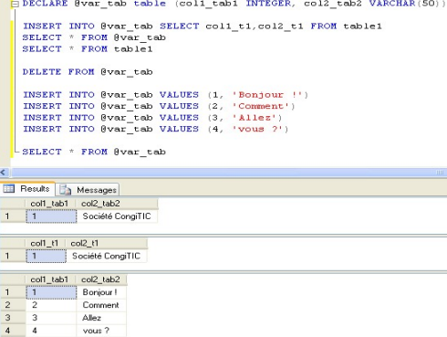

# table temporaire

#Table

# Variable temporaire

@Variable

peut contenir une suite d'instruction

```sql
DECLARE @SQL VARCHAR(1000)

Set @SQL = 'SELECT * FROM' + @nom_table
	   + ' WHERE ' + @liste_des_colonnes
	   + ' LIKE ''%' + @mot_a_chercher + '%'''

EXEC(@SQL)
```

# Instruction SET

donner une valeur aux variable mais aussi donner certaines options à la DB

# instrution CONVERT

forece set un type de valeur

# concat +

# type de données table



# Contrôle conditionnel

## Intruction IF

à l'intérieur d'un coupe Begin END

```sql
DECLARE @variable INTEGER
SET @variable = 20

IF (@variable > 10)
	BEGIN
		PRINT @variable
	END
ELSE
	BEGIN
		PRINT 'Variable plus petite que 10'
	END

```

## Instruction CASE

Le problème avec les instructions case est qu’elles sont obligatoirement utilisées dans un
SELECT et que de ce fait, elles ne nous renvoient aucune information à moins de stocker le
résultat de la requête dans une variable de type TABLE ou encore dans une table temporaire

```sql
SELECT
CASE
	WHEN YEAR(Birthdate) > 2000 THEN 'Trop jeune'
	WHEN YEAR(Birthdate) BETWEEN 1990 AND 2000 THEN 'Jeune recrue'
	WHEN YEAR(Birthdate) BETWEEN 1980 AND 1989 THEN 'Dans la fleur de l''age'
	WHEN YEAR(Birthdate) BETWEEN 1970 AND 1979 THEN 'Roule sa bosse'
	ELSE 'Valeur improbable'
END
FROM HumanResources.Employee
WHERE BusinessEntityID = 21
```

deviendra donc

```sql
DECLARE @anne_emp VARCHAR(30)
SELECT @annee_emp = CASE
			WHEN YEAR(Birthdate) > 2000 THEN 'Trop jeune'
			WHEN YEAR(Birthdate) BETWEEN 1990 AND 2000 THEN 'Jeune recrue'
			WHEN YEAR(Birthdate) BETWEEN 1980 AND 1989 THEN 'Dans la fleur de l''age'
			WHEN YEAR(Birthdate) BETWEEN 1970 AND 1979 THEN 'Roule sa bosse'
			ELSE 'Valeur improbable'
		     END
FROM HumanResources.Employee
WHERE BusinessEntityID = 21
```

# Boucles et Curseur

# Fonctions et Procédures

## Fonctions

*"Une UDF, ou « User Defined Function » (Fonction Définie par l'Utilisateur) est un
ensemble de commandes regroupées sous un même nom d’objet, que l’on définit
pour des besoins de traitements récurrents au sein des requêtes et du code des
procédures stockées ou des triggers. Elle fait donc partie intégrante de la base de
données, où elle est considérée comme un objet à part entière, au même titre
qu'une table, une vue, un utilisateur ou une procédure stockée."*

Une fonction est un ensemble d’instructions qui remplissent une tâche particulière
et surtout, **renvoient** une valeur ou un ensemble de données (table)

**PAS DE DML DANS UNE FONCTION MAIS DANS UNE PROCÉDURE ON PEUT**

On peut définir un comportement personnalisé et y faire appel par après

```sql
select * from  dbo.get_all_employees()
```

sera défini comme suit 

```sql
CREATE FUNCTION get_all_employees()
RETURNS TABLE  -- on définit le type du return 
SELECT * from person.person
```

On suit généralement le template suivant 

```sql
SET ANSI_NULLS ON
GO
SET QUOTED_IDENTIFIER ON
GO

CREATE FUNCTION <Inline_Function_Name, sysname, FunctionName> 
(
	-- Add the parameters for the function here
	<@param1, sysname, @p1> <Data_Type_For_Param1, , int>, 
	<@param2, sysname, @p2> <Data_Type_For_Param2, , char>
)
RETURNS TABLE 
AS
RETURN 
(
	-- Add the SELECT statement with parameter references here
	SELECT 0
)
GO

```

## Procédures

*"Une procédure est également un objet de la base de données, regroupant un
ensemble de commandes qui effectuent une tâche particulière (le plus souvent
récurrente).
La différence fondamentale entre les procédures et les fonctions est qu’une
procédure ne renvoie aucune valeur (du moins pas classiquement…)"*
