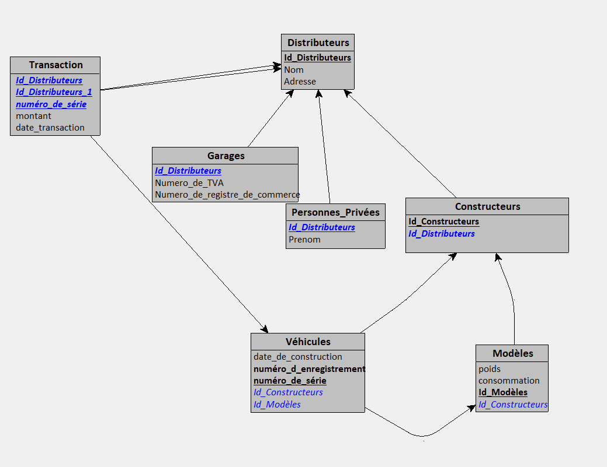

# L'enregistrement automobile

L'administration d'enregistrement des véhicules désire disposer d'un système d'informations relatif aux constructeurs de véhicules. Pour chacun des constructeurs, on désire connaître l'ensemble des véhicules qu'il a construits. Un véhicule est caractérisé par un modèle, sa date de construction, son constructeur et un numéro de série attribué par le constructeur. Ce numéro de série l'identifie parmi tous les véhicules construits par constructeur.

Un constructeur est identifié par un nom et possède une adresse. Il travaille avec un certain nombre de distributeurs (garages concessionnaires). Un distributeur est caractérisé par un nom et possède une adresse. Il n'existe pas deux distributeurs de même nom dans une même localité. Un distributeur peut travailler avec plusieurs constructeurs.

Un modèle de véhicule n'est produit que par un seul constructeur. Tous les véhicules d'un même modèle sont caractérisés par une consommation et un poids, identiques pour chacun des véhicules de ce modèle. Il est possible qu'aucun véhicule correspondant à un modèle produit par un constructeur ne soit déjà construit.

L'administration d'enregistrement des véhicules désire également connaître les informations relatives aux propriétaires (successifs) et aux transactions (achat/vente) effectuées sur les véhicules. À chaque véhicule, elle assigne un numéro d'enregistrement. Il n'existe pas deux véhicules ayant le même numéro d'enregistrement. À tout moment, un véhicule n'appartient qu'à un seul propriétaire, qui est soit un constructeur, soit un garage, ou encore une personne privée. Il peut avoir été possédé par plusieurs propriétaires (à des moments distincts).

Un constructeur, un garage ou une personne privée est connu de l'administration d'enregistrement des véhicules, c'est-à-dire considéré comme faisant partie de l'ensemble des propriétaires que s'il possède ou a possédé un véhicule. Qu'il soit constructeur, garage ou particulier, un propriétaire est caractérisé par un numéro l'identifiant.

Pour un constructeur, on connaît son nom, son adresse ainsi que les garages avec lesquels il travaille (garage concessionnaire). Un garage est caractérisé par un nom, une adresse, un numéro de registre de commerce et un numéro de TVA. On connaît le nom, le prénom et l'adresse d’une personne privée.

Pour toute transaction effectuée sur un véhicule, on connaît le vendeur (l'ancien propriétaire), l'acheteur (le nouveau propriétaire), la date de transaction et le prix d'achat/vente. Un véhicule peut faire l'objet de plusieurs transactions (à des dates différentes). Il est possible que deux transactions réalisées à des dates différentes puissent porter sur un même véhicule, un même vendeur et un même acheteur.

Un constructeur ne peut vendre ses véhicules à d'autres constructeurs ni directement à des particuliers. Il ne les vend qu'à ses garages concessionnaires. Il n'achète aucun véhicule. Un garage peut vendre ou acheter des véhicules à des personnes privées ou à des garages. Il peut, bien sûr, également acheter des véhicules aux constructeurs pour lesquels il est concessionnaire. Un particulier ne peut vendre ou acheter des véhicules qu'à d'autres particuliers ou à des garages. Ceci signifie donc que seuls, les véhicules dont le propriétaire "du moment" est un constructeur, n'ont été l'objet d'aucune transaction.

## découpe en entité et attributs

| Entités       | Attributs                                                                  | Sous-Entités (spécialisation) | Sous-Attributs                   | Remarque                                                                                                                                             |
| -------------- | -------------------------------------------------------------------------- | ------------------------------- | -------------------------------- | ---------------------------------------------------------------------------------------------------------------------------------------------------- |
| distributeurs  | nom                                                                        |                                 |                                  |                                                                                                                                                      |
|                | adresse                                                                    |                                 |                                  |                                                                                                                                                      |
|                | id                                                                         |                                 |                                  |                                                                                                                                                      |
|                | ====>                                                                      | Constructeurs                   | distributeur id                  |                                                                                                                                                      |
|                |                                                                            |                                 | garage avec lesquel il travaille |                                                                                                                                                      |
|                |                                                                            |                                 |                                  |                                                                                                                                                      |
|                | ====>                                                                      | Garages                         | distributeur id                  |                                                                                                                                                      |
|                |                                                                            |                                 | numéro de TVA                   | il n'existe pas deux distributeur avec le même nom dans la même localité<br />donc pk = nom+adresse                                              |
|                |                                                                            |                                 | numéro de registre de commerce  | un distributeur peut travailler avec plusieurs constructeurs (many)                                                                                 |
|                |                                                                            |                                 |                                  |                                                                                                                                                      |
|                |                                                                            |                                 |                                  |                                                                                                                                                      |
|                | ====>                                                                      | Personne privées               | distributeur id                  | spécialisation de la classe ditributeurs on hérite de nom + adresse et on ajoute prenom                                                            |
|                |                                                                            |                                 | prénom                          |                                                                                                                                                      |
|                |                                                                            |                                 |                                  |                                                                                                                                                      |
|                |                                                                            |                                 |                                  |                                                                                                                                                      |
|                |                                                                            |                                 |                                  |                                                                                                                                                      |
| Véhicules     |                                                                            |                                 |                                  | table intermédiaire vehicule/proprio qui ressemble à vehicule_id, proprio_id, date de vente (null possible)<br />pk = véhicule_id,proprio_id,date |
|                | modèle (FK Modèles)                                                      |                                 |                                  |                                                                                                                                                      |
|                | date de construction                                                       |                                 |                                  |                                                                                                                                                      |
|                | contructeur                                                                |                                 |                                  |                                                                                                                                                      |
|                | n° de série donné par le constructeur (FK Constructeurs)                |                                 |                                  |                                                                                                                                                      |
|                | numéro d'enregistrement  unique                                          |                                 |                                  |                                                                                                                                                      |
|                |                                                                            |                                 |                                  |                                                                                                                                                      |
| Modèles       | produit par un seul constructeur                                           |                                 |                                  |                                                                                                                                                      |
|                | consommation                                                               |                                 |                                  |                                                                                                                                                      |
|                | poids                                                                      |                                 |                                  |                                                                                                                                                      |
|                |                                                                            |                                 |                                  |                                                                                                                                                      |
| Transaction    | véhicule_id                                                               |                                 |                                  | PK                                                                                                                                                   |
|                | revendeur                                                                  |                                 |                                  | PK si revendeur est un constructeur alors acheteur doit être garage                                                                                 |
|                | acheteur                                                                   |                                 |                                  | PK + acheteur ne peut pas être un constructeur donc not in constructeur                                                                             |
|                | montant                                                                    |                                 |                                  |                                                                                                                                                      |
|                | date                                                                       |                                 |                                  | PK                                                                                                                                                   |
|                |                                                                            |                                 |                                  |                                                                                                                                                      |
| Propriétaires | vehicules_id (numéro d'enregistrement)                                    |                                 |                                  |                                                                                                                                                      |
|                | propriétaire id = transaction_id dernière occurence pour ce véhicule id |                                 |                                  |                                                                                                                                                      |
|                | date de l'acquisition (null possible)                                      |                                 |                                  |                                                                                                                                                      |

## Modélisation Looping



## Script SQL déclaratif 

```sql
CREATE TABLE Distributeurs(
   Id_Distributeurs COUNTER,
   Nom VARCHAR(50),
   Adresse VARCHAR(50),
   PRIMARY KEY(Id_Distributeurs)
);

CREATE TABLE Constructeurs(
   Id_Constructeurs COUNTER,
   Id_Distributeurs INT NOT NULL,
   PRIMARY KEY(Id_Constructeurs),
   UNIQUE(Id_Distributeurs),
   FOREIGN KEY(Id_Distributeurs) REFERENCES Distributeurs(Id_Distributeurs)
);

CREATE TABLE Garages(
   Id_Distributeurs INT,
   Numero_de_TVA VARCHAR(50),
   Numero_de_registre_de_commerce VARCHAR(50),
   PRIMARY KEY(Id_Distributeurs),
   FOREIGN KEY(Id_Distributeurs) REFERENCES Distributeurs(Id_Distributeurs)
);

CREATE TABLE Personnes_Privées(
   Id_Distributeurs INT,
   Prenom VARCHAR(50),
   PRIMARY KEY(Id_Distributeurs),
   FOREIGN KEY(Id_Distributeurs) REFERENCES Distributeurs(Id_Distributeurs)
);

CREATE TABLE Modèles(
   Id_Modèles COUNTER,
   poids REAL NOT NULL,
   consommation REAL,
   Id_Constructeurs INT NOT NULL,
   PRIMARY KEY(Id_Modèles),
   FOREIGN KEY(Id_Constructeurs) REFERENCES Constructeurs(Id_Constructeurs)
);

CREATE TABLE Véhicules(
   numéro_de_série COUNTER,
   date_de_construction DATE NOT NULL,
   numéro_d_enregistrement COUNTER NOT NULL,
   Id_Constructeurs INT NOT NULL,
   Id_Modèles INT NOT NULL,
   PRIMARY KEY(numéro_de_série),
   UNIQUE(numéro_d_enregistrement),
   FOREIGN KEY(Id_Constructeurs) REFERENCES Constructeurs(Id_Constructeurs),
   FOREIGN KEY(Id_Modèles) REFERENCES Modèles(Id_Modèles)
);

CREATE TABLE Transaction(
   Id_Distributeurs INT,
   Id_Distributeurs_1 INT,
   numéro_de_série INT,
   montant CURRENCY NOT NULL,
   date_transaction DATETIME NOT NULL,
   PRIMARY KEY(Id_Distributeurs, Id_Distributeurs_1, numéro_de_série),
   FOREIGN KEY(Id_Distributeurs) REFERENCES Distributeurs(Id_Distributeurs),
   FOREIGN KEY(Id_Distributeurs_1) REFERENCES Distributeurs(Id_Distributeurs),
   FOREIGN KEY(numéro_de_série) REFERENCES Véhicules(numéro_de_série)
);

```
