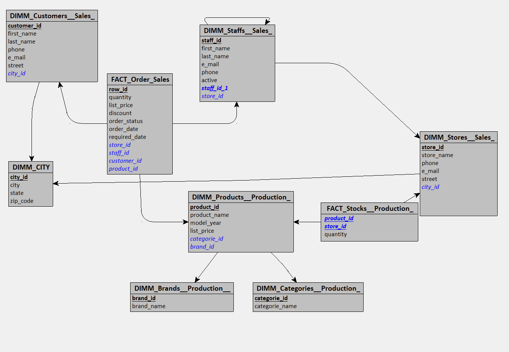

exo bike store

création d'un schéma looping (on pourrait ajouter brand et catégorie dans product



looping nous donne le script de génération SQL suivant :

```sql
USE DW_Bike_Store_DB;
GO

BEGIN TRANSACTION;

CREATE TABLE DIMM_Brands__Production__(
   brand_id INT,
   brand_name VARCHAR(50),
   PRIMARY KEY(brand_id)
);

CREATE TABLE DIMM_Categories__Production_(
   categorie_id INT,
   categorie_name VARCHAR(50),
   PRIMARY KEY(categorie_id)
);

CREATE TABLE DIMM_Products__Production_(
   product_id INT,
   product_name VARCHAR(50),
   model_year VARCHAR(50),
   list_price VARCHAR(50),
   categorie_id INT NOT NULL,
   brand_id INT NOT NULL,
   PRIMARY KEY(product_id),
   FOREIGN KEY(categorie_id) REFERENCES DIMM_Categories__Production_(categorie_id),
   FOREIGN KEY(brand_id) REFERENCES DIMM_Brands__Production__(brand_id)
);

CREATE TABLE DIMM_CITY(
   city_id INT,
   city VARCHAR(50),
   state VARCHAR(50),
   zip_code INT,
   PRIMARY KEY(city_id)
);

CREATE TABLE DIMM_Customers__Sales_(
   customer_id INT,
   first_name VARCHAR(50),
   last_name VARCHAR(50),
   phone VARCHAR(50),
   e_mail VARCHAR(50),
   street VARCHAR(50),
   city_id INT NOT NULL,
   PRIMARY KEY(customer_id),
   FOREIGN KEY(city_id) REFERENCES DIMM_CITY(city_id)
);

CREATE TABLE DIMM_Stores__Sales_(
   store_id INT,
   store_name VARCHAR(50),
   phone VARCHAR(50),
   e_mail VARCHAR(50),
   street VARCHAR(50),
   city_id INT NOT NULL,
   PRIMARY KEY(store_id),
   FOREIGN KEY(city_id) REFERENCES DIMM_CITY(city_id)
);

CREATE TABLE DIMM_Staffs__Sales_(
   staff_id INT,
   first_name VARCHAR(50),
   last_name VARCHAR(50),
   e_mail VARCHAR(50),
   phone VARCHAR(50),
   active BIT,
   staff_id_1 INT,
   store_id INT NOT NULL,
   PRIMARY KEY(staff_id),
   UNIQUE(staff_id_1),
   FOREIGN KEY(staff_id_1) REFERENCES DIMM_Staffs__Sales_(staff_id),
   FOREIGN KEY(store_id) REFERENCES DIMM_Stores__Sales_(store_id)
);

CREATE TABLE FACT_Order_Sales(
   row_id INT,
   quantity INT,
   list_price DECIMAL(15,2),
   discount DECIMAL(4,1),
   order_status VARCHAR(50),
   order_date DATETIME,
   required_date DATETIME,
   store_id INT NOT NULL,
   staff_id INT NOT NULL,
   customer_id INT NOT NULL,
   product_id INT NOT NULL,
   PRIMARY KEY(row_id),
   FOREIGN KEY(store_id) REFERENCES DIMM_Stores__Sales_(store_id),
   FOREIGN KEY(staff_id) REFERENCES DIMM_Staffs__Sales_(staff_id),
   FOREIGN KEY(customer_id) REFERENCES DIMM_Customers__Sales_(customer_id),
   FOREIGN KEY(product_id) REFERENCES DIMM_Products__Production_(product_id)
);

CREATE TABLE FACT_Stocks__Production_(
   product_id INT,
   store_id INT,
   quantity INT,
   PRIMARY KEY(product_id, store_id),
   FOREIGN KEY(product_id) REFERENCES DIMM_Products__Production_(product_id),
   FOREIGN KEY(store_id) REFERENCES DIMM_Stores__Sales_(store_id)
);


    COMMIT;

```
