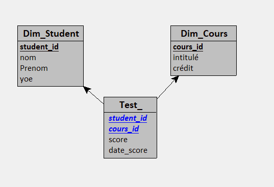

La  Business Inteligence a pour but de venir en aide comme un support à la prise de décision en fournissant des visuels, représentationsn etc ....
On préfère des base de données staging cad des base de données un peu durable, cad pas une db qui change trop régulièrement

Traditionellement on évite les jointures dans la représentation dimmentionelle. 

# Q1)

En sachant que dans la modelisation dimensionnelle, nous avons 2 type de tables:
des ‘faits’ et des ‘dimensions’, quelles sont les colonnes qui auraient leur places dans:

la/les tables de faits ? Quels faits? - la/les tables de dimensions ? Quelles dimensions?

| fait  | dim   |
| ----- | ----- |
| score | stu   |
|       | cours |

table fait score lie l'id student à un id cours avec une valeur et une date

table dim student lie un id student à ses informations comme son nom, prénom, mai s aussi son yoe

table dimm cours qui lie l'id du cours son nom et ses crédits

# Q2)

Dessiner le schema dimensionnel (relationnel) pour ces données/tables.



# Q3)

 Quelles sont les transformations nécéssaires pour placer les colonnes (de la ‘big
table’) dans leur tables faits-dimension respectives ? (=ETL)

1. Créer la table student

   ```sql
   use DATABIG
   -- Create the Students table if it doesn't exist
   IF NOT EXISTS (SELECT * FROM sys.tables WHERE name = 'Students' AND type = 'U')
   BEGIN
       CREATE TABLE Students
       (
           StudentID INT PRIMARY KEY,
           StudentFirstName VARCHAR(50),
           StudentLastName VARCHAR(50),
           StudentYOE INT
       );
   END

   -- Insert data into the Students table
   INSERT INTO Students (StudentID, StudentFirstName, StudentLastName, StudentYOE)
   SELECT DISTINCT id_st, first_name, last_name, yoe 
   FROM data_big
   ```
2. Créer la table course
   même genre que pour student
3. Créer la table Score

   ```sql
   use DATABIG
   -- Create the Students table if it doesn't exist
   IF NOT EXISTS (SELECT * FROM sys.tables WHERE name = 'Score' AND type = 'U')
   BEGIN
       CREATE TABLE Score
       (
           courseID INT ,
           studentID INT ,
           score FLOAT,
           score_date DATE
           CONSTRAINT PK_Score PRIMARY KEY (courseID, studentID, score_date,score)

       );
   END

   -- Insert data into the Students table
   INSERT INTO Score (courseID,studentID, score,score_date)
   SELECT DISTINCT id_course,id_st, lst_scores,dates
   FROM data_big
   GROUP BY id_course, id_st, lst_scores,dates

   ```

Songer à réaliser les seed dans des transaction comme  ca on peut toujours roll back au besoin (pour plus de "sécurité")

# Q4)

Donner quelques (>=3) questions business pour lesquel on sais répondre avec les
données de ‘big table’. Quelles sont les requêtes SQL qui permettent d’y répondre ?

* obtenir l'année d'inscription d'un élève à l'établissement

```SQL
Select  
    concat(StudentFirstName, StudentLastName) as FullName,
    StudentYOE as 'Incription in',
    YEAR(GETDATE()) - StudentYOE as 'Years of study'
from dbo.Students
```

* la moyenne générale d'un cours obtenue

```sql
SELECT  
    c.courseID,
    c.course_name, 
    (SELECT ROUND(AVG(s.score), 2) FROM dbo.Score s WHERE s.courseID = c.courseID) AS average_score
FROM dbo.Course c
ORDER BY c.courseID;
```

* moyenne par cours par année

  ```sql
  SELECT 
      c.courseID,
      c.course_name, 
      subquery.year,
      subquery.average_score
  FROM dbo.Course c
  INNER JOIN (
      SELECT s.courseID, YEAR(s.score_date) AS year, ROUND(AVG(s.score), 2) AS average_score
      FROM dbo.Score s
      GROUP BY s.courseID, YEAR(s.score_date)
  ) AS subquery ON c.courseID = subquery.courseID
  ORDER BY c.courseID;
  ```
