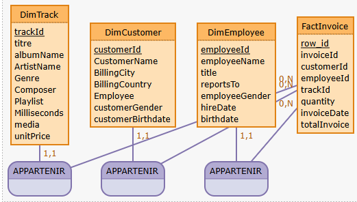

1) Quels sont les artistes qui ont le plus de succès auprès des hommes/femmes
2) Quelle est la tranche d'age la moins satisfaite par le services (via survey.xls)
3) Quel est l'employé qui a vendu le moins => qui n'a pas atteint son quota trimestriel
4) Quels sont les titres/genre les plus populaires par pays/continents
5) 

pour faire le schéma on peut utiliser mocodo online
en gros via python on peut créer les différentes structures 


Piste 1 : une grosse table qui fait tout .
un peu trop gros 

```sql
select top 1000
t.TrackId,
t.Name as titre,
a.Title as 'Album name',
art.Name as 'Artist name',
g.Name as genre,
t.Composer,
p.Name as 'Inside playlist',
Milliseconds,
t.UnitPrice,
c.FirstName+' '+c.LastName as Customer,
e.FirstName+' '+e.LastName as Employee,
il.Quantity,
il.InvoiceId,
i.InvoiceDate,
i.BillingCity,
i.BillingCountry,
i.Total,
m.Name as media
from Track as t
join InvoiceLine as il on t.TrackId= il.TrackId
join Invoice as i on i.InvoiceId = il.InvoiceId
join Album as a on t.AlbumId = a.AlbumId
join MediaType	as m on t.MediaTypeId = t.MediaTypeId
join genre as g on g.GenreId=t.GenreId
join Customer as c on c.CustomerId = i.CustomerId
join Employee as e on e.EmployeeId = c.SupportRepId
join Artist as art on art.ArtistId = a.ArtistId
join PlaylistTrack as pt on t.TrackId = pt.TrackId
join Playlist as p on p.PlaylistId = pt.PlaylistId


```


piste 2 : quelques jointures: 

table dimm_track:

* trackId
* titre
* albumName
* ArtistName
* Genre
* Composer
* Playlist
* Milliseconds
* media
* unnitPrice

table dimm customer:

* customerId
* CustomerName
* BillingCity
* BillingCoutry
* Employee

via excel:

* customerGender
* customerBirthdate

table dimm employee:

* employeeId
* employeeName concat (first+ lastname)
* title
* reportsTo
* employeeGender
* hireDate
* birthdate

Table Fact Invoice:

* row_id
* invoiceId
* customerId
* employeeId
* trackId
* quantity
* invoiceDate
* totalInvoice

Script mocodo pour créer le schéma 

```python
DimTrack: trackId, titre, albumName, ArtistName, Genre, Composer, Playlist, Milliseconds, media, unitPrice
DimCustomer: customerId, CustomerName, BillingCity, BillingCountry, Employee, customerGender, customerBirthdate
DimEmployee: employeeId, employeeName, title, reportsTo, employeeGender, hireDate, birthdate
FactInvoice: row_id, invoiceId, customerId, employeeId, trackId, quantity, invoiceDate, totalInvoice

APPARTENIR1, 0N FactInvoice, 11 DimTrack
APPARTENIR2, 0N FactInvoice, 11 DimCustomer
APPARTENIR3, 0N FactInvoice, 11 DimEmployee
```



maintenant on intègre les données excel

Table fact target

* employeId
* year
* targetQ1
* targetQ2
* targetQ3
* targetQ4

table DImm continent 

* countryId
* coutryName
* countryContinent

table FACT survey

* customerID
* customerGender
* birthdate( convert concat (day,month,year),date)
* rateQ1
* rateQ2
* rateQ3

table dimm question

* questionId
* questionSentence

```python
%%mocodo
:::
Dim_Country: row_id, city, country, continent
:::
Dim_Customer: customer_id, customer_name, customer_gender, customer_birthdate
:::::


:::
Fact_Invoice: invoice_id, track_id, quantity, total_Invoice, city_id, customer_id, employee_id, date
:::
Dim_Employee: row_id, employee_id, employee_name, title, reports_to, employee_gender, target_Q1, target_Q2, target_Q3, target_Q4, hire_date
:
Fact_Survey: row_id, rate, customer_id, question_id
:::


:
Dim_Track: row_id, titre, album_Name, Artist_Name, Genre, Composer, Playlist, Milliseconds, media, unit_Price
:::
Dim_Date: row_id, day, month, year
:::::
Dim_Question: question_id, question_Sentence
:


```


Script SQL 

```sql
-- Generated by Mocodo 4.2.12

CREATE TABLE Dim_Country (
  PRIMARY KEY (row_id),
  row_id    VARCHAR(42) NOT NULL,
  city      VARCHAR(42),
  country   VARCHAR(42),
  continent VARCHAR(42)
);

CREATE TABLE Dim_Customer (
  PRIMARY KEY (customer_id),
  customer_id        VARCHAR(42) NOT NULL,
  customer_name      VARCHAR(42),
  customer_gender    VARCHAR(42),
  customer_birthdate VARCHAR(42)
);

CREATE TABLE Dim_Date (
  PRIMARY KEY (row_id),
  row_id VARCHAR(42) NOT NULL,
  day    VARCHAR(42),
  month  VARCHAR(42),
  year   VARCHAR(42)
);

CREATE TABLE Dim_Employee (
  PRIMARY KEY (row_id),
  row_id          VARCHAR(42) NOT NULL,
  employee_id     VARCHAR(42),
  employee_name   VARCHAR(42),
  title           VARCHAR(42),
  reports_to      VARCHAR(42),
  employee_gender VARCHAR(42),
  target_Q1       VARCHAR(42),
  target_Q2       VARCHAR(42),
  target_Q3       VARCHAR(42),
  target_Q4       VARCHAR(42),
  hire_date       VARCHAR(42)
);

CREATE TABLE Dim_Question (
  PRIMARY KEY (question_id),
  question_id       VARCHAR(42) NOT NULL,
  question_Sentence VARCHAR(42)
);

CREATE TABLE Dim_Track (
  PRIMARY KEY (row_id),
  row_id       VARCHAR(42) NOT NULL,
  titre        VARCHAR(42),
  album_Name   VARCHAR(42),
  Artist_Name  VARCHAR(42),
  Genre        VARCHAR(42),
  Composer     VARCHAR(42),
  Playlist     VARCHAR(42),
  Milliseconds VARCHAR(42),
  media        VARCHAR(42),
  unit_Price   VARCHAR(42)
);

CREATE TABLE Fact_Invoice (
  PRIMARY KEY (invoice_id),
  invoice_id    VARCHAR(42) NOT NULL,
  track_id      VARCHAR(42),
  quantity      VARCHAR(42),
  total_Invoice VARCHAR(42),
  city_id       VARCHAR(42),
  customer_id   VARCHAR(42),
  employee_id   VARCHAR(42),
  date          VARCHAR(42)
);

CREATE TABLE Fact_Survey (
  PRIMARY KEY (row_id),
  row_id      VARCHAR(42) NOT NULL,
  rate        VARCHAR(42),
  customer_id VARCHAR(42),
  question_id VARCHAR(42)
);


```
