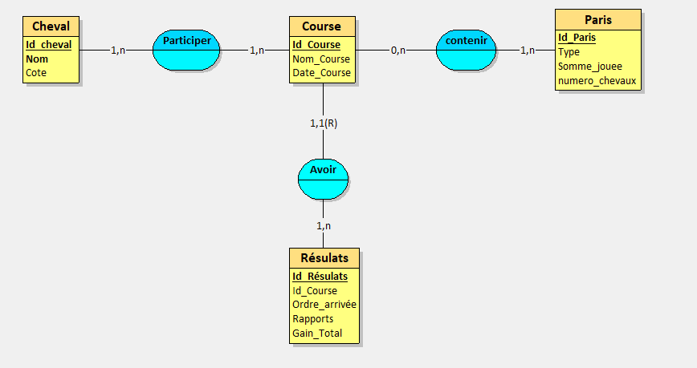
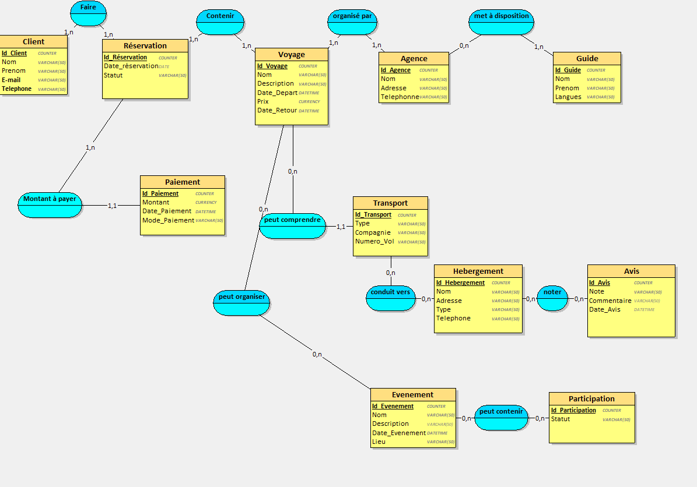

# schéma entité-association

## exo 1

## exo 2

## exo 3

## exo 4

## exo 5

## exo bonus entité association

Énoncé d'exercice supplémentaire de modélisation de base de données :
Vous devez concevoir le modèle conceptuel de données pour une application de votre choix.
Sélectionnez un thème qui vous intéresse (par exemple, gestion de bibliothèque, e-commerce,
réseaux sociaux, etc.) et respectez les consignes suivantes :
Consignes :

1. Entités :
   o Votre modèle doit comporter au moins 10 entités distinctes.
   o Identifiez les attributs principaux de chaque entité ainsi que leurs clés primaires.
2. Associations :
   o Intégrez au moins une relation pour chaque type d'association suivant :
   ▪ One-to-One : Les deux bornes supérieures des cardinalités valent 1.
   ▪ One-to-Many : Une borne supérieure vaut 1, l'autre est strictement supérieure à
3.

▪ Many-to-Many : Les deux bornes supérieures des cardinalités sont strictement
supérieures à 1. 3. Relations et cardinalités :
o Définissez les relations entre les entités, leurs cardinalités, et les éventuelles clés
étrangères. 4. Livrable attendu :
o Présentez un diagramme clair du modèle conceptuel avec toutes les entités, attributs
et relations.
o Expliquez brièvement les choix de cardinalité pour chaque relation.
Astuce : Choisissez un thème qui vous inspire pour rendre l'exercice plus intéressant et pertinent !

